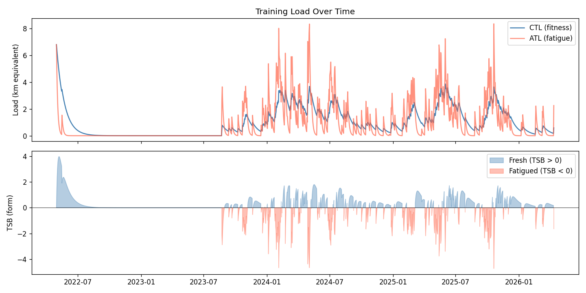
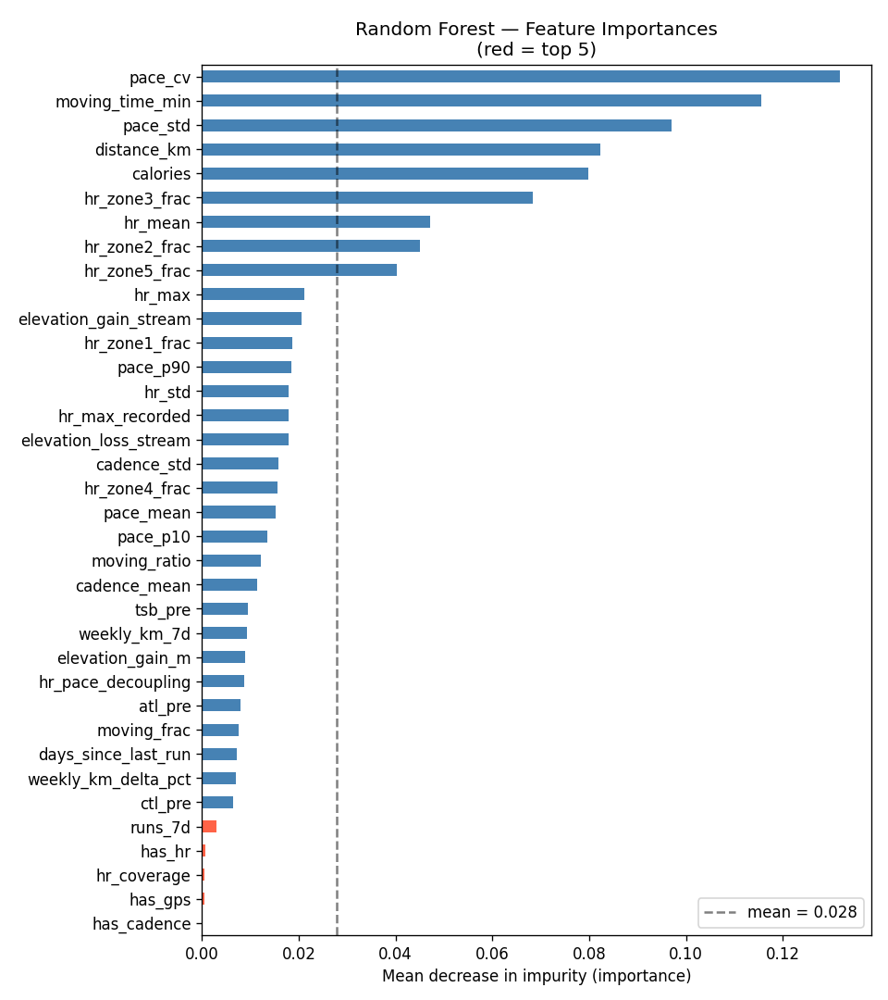
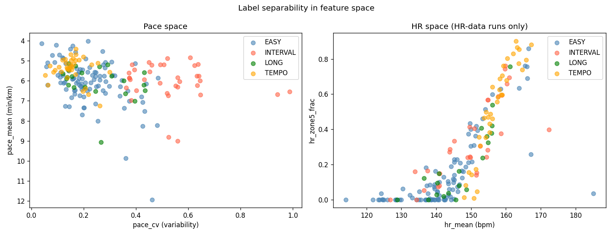
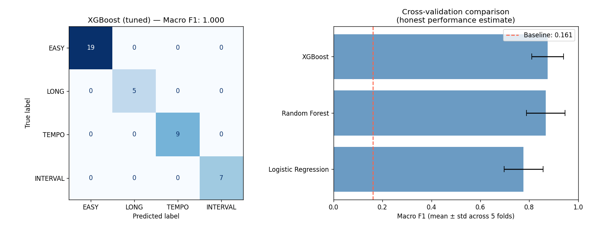

# Strava Running ML — Workout Type Classifier

A machine learning pipeline that classifies running workouts into four types
(**EASY, LONG, TEMPO, INTERVAL**) from raw Garmin/Strava activity files.
Trained on 4 years of personal GPS, heart rate, and cadence data.
Exports to ONNX for lightweight inference on any device.

---

## Results

| Model | CV Macro F1 (mean ± std) |
|---|---|
| Majority class baseline | 0.161 |
| Logistic Regression | 0.777 ± 0.079 |
| Random Forest | 0.868 ± 0.079 |
| **XGBoost (tuned)** | **0.875 ± 0.065** |

Evaluated with 5-fold `TimeSeriesSplit` — trains on past runs, validates on
future runs. No data leakage.

---

## Demo

```bash
# Classify a single activity
python src/infer.py --file data/raw/activities/11147594123.fit.gz --verbose
```

```
─────────────────────────────────────────────
File:      11147594123.fit.gz
Duration:  30 min  |  Distance: 5.1 km
Pace:      5.91 min/km  (cv=0.40)
HR mean:   137 bpm  Z4+Z5: 51%
─────────────────────────────────────────────
Predicted: EASY
Confidence:
  EASY       0.96  ███████████████████
  INTERVAL   0.04  
  LONG       0.00  
  TEMPO      0.00  
─────────────────────────────────────────────
```

---

## Pipeline

```
Raw .fit.gz / .gpx files
        ↓
  Phase 1: Parsing          fitparse + XML → per-second DataFrames
        ↓
  Phase 2: Features         22 features across 3 groups
        ↓
  Phase 3: Labelling        Weak supervision heuristic → XGBoost
        ↓
  Phase 4: Export           ONNX → inference CLI
```

### Feature groups

**Within-run** (from per-second stream data)
- Pace statistics: mean, std, CV, p10/p90
- HR zone distribution: fraction of time in Z1–Z5
- HR-pace aerobic decoupling metric
- Cadence mean and std
- Elevation gain/loss from altimeter deltas

**Summary** (from `activities.csv`)
- Distance, moving time, elevation gain, moving ratio

**Rolling training load** (computed from full history)
- ATL (7-day exponential weighted load) — acute fatigue
- CTL (42-day exponential weighted load) — chronic fitness  
- TSB (CTL − ATL) — form/freshness
- Weekly volume, run frequency, days since last run

---

## Project Structure

```
strava-ml/
├── data/
│   ├── raw/               ← Strava export (gitignored)
│   └── processed/         ← Parsed CSVs, feature table, plots
├── models/
│   ├── classifier.onnx    ← Portable inference model
│   ├── feature_cols.json  ← Feature order for inference
│   └── label_map.json     ← Integer → label mapping
├── notebooks/
│   ├── 01_data_ingestion.ipynb
│   ├── 02_features.ipynb
│   └── 03_classifier.ipynb
└── src/
    └── infer.py           ← Standalone inference CLI
```

---

## Quickstart

```bash
# 1. Clone and install
git clone https://github.com/salcxjo/strava-ml
cd strava-ml
pip install fitparse pandas numpy scikit-learn xgboost onnxruntime tqdm

# 2. Export your Strava data
# Settings → My Account → Download or Delete Your Account → Request Archive
# Extract into data/raw/

# 3. Run the notebooks in order
jupyter notebook notebooks/01_data_ingestion.ipynb

# 4. Classify an activity
python src/infer.py --file data/raw/activities/<your_activity>.fit.gz --verbose
```

---

## Key learnings

**Temporal splits matter.** Random train/test split on time-series data
inflates metrics by letting future patterns leak into training. All evaluation
uses `TimeSeriesSplit`.

**Features beat model complexity.** Logistic regression on well-engineered
features (0.777 CV F1) outperforms naive tree models. XGBoost wins at 0.875
but the gap is smaller than expected — the features are doing most of the work.

**Weak supervision.** No ground-truth workout labels exist in Strava exports.
Labels are generated from physiological heuristics (pace variability, HR zones,
distance thresholds) calibrated to personal data distributions rather than
generic thresholds.

**ONNX portability.** The trained pipeline exports to a ~200KB ONNX file that
runs with `onnxruntime` — no sklearn, no XGBoost, no Python ML stack required
at inference time. Same pattern as TFLite deployment on embedded devices.

---

## Visualisations

### Training load over time (CTL / ATL / TSB)


### Feature importances


### Label separability in feature space


### Cross-validation model comparison


---

## Transferability to edge ML

| Skill | Edge ML equivalent |
|---|---|
| Sliding window aggregation over 1Hz signals | Real-time inference on IMU/sensor streams |
| Per-second feature extraction | Wearable activity recognition (HAR) |
| ONNX export + onnxruntime inference | TFLite / CoreML deployment on embedded devices |
| Null handling for sensor dropout | Robust inference with missing sensor channels |
| Temporal CV evaluation | Correct evaluation of deployed time-series models |

---

## What's next — `--history` mode

Currently `infer.py` defaults ATL/CTL/TSB to zero when classifying a
standalone file. The next step is a `--history` flag that reads your full
`runs.csv`, computes real rolling training load up to the activity date, and
feeds those values into the model — making classification context-aware.

A run classified after a 100km training week should look different to the model
than the same run after two weeks off. Right now it doesn't. This closes that
gap and makes the CLI genuinely useful for ongoing personal use.

```bash
# Planned usage
python src/infer.py \
  --file data/raw/activities/11147594123.fit.gz \
  --history data/processed/runs.csv \
  --verbose
```

---

## Data privacy

Raw activity files and processed CSVs are gitignored. Only model artifacts
and source code are committed. To reproduce, export your own Strava archive.
